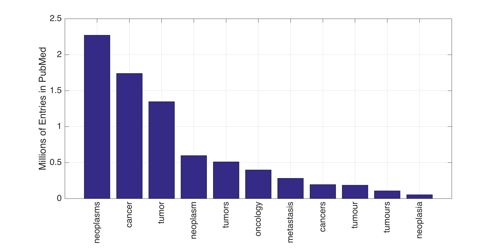
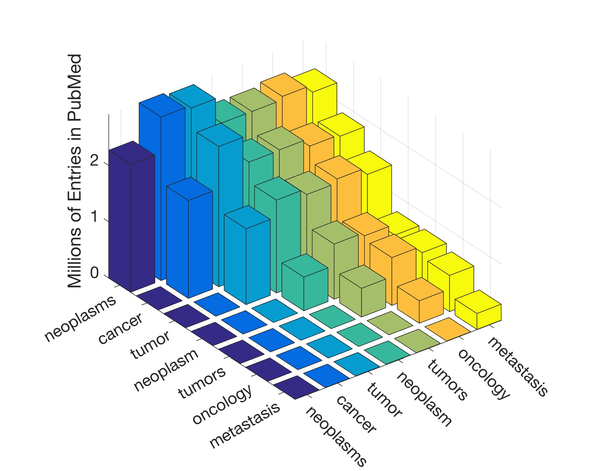
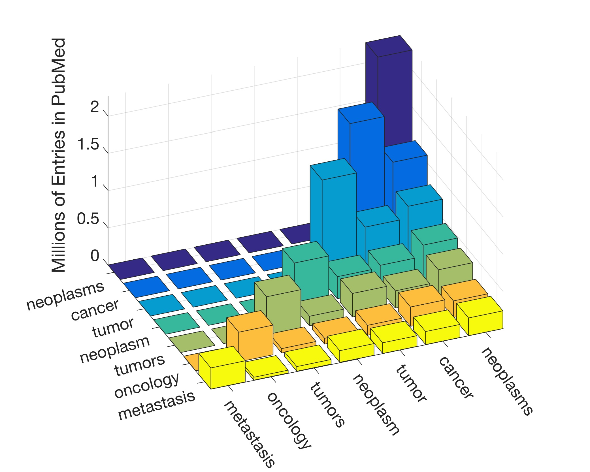
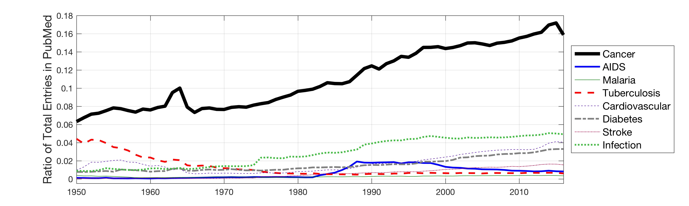
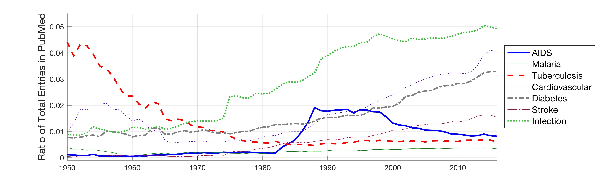
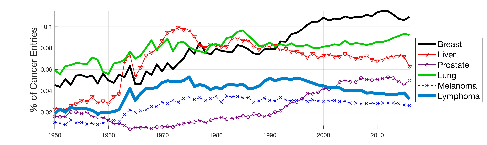
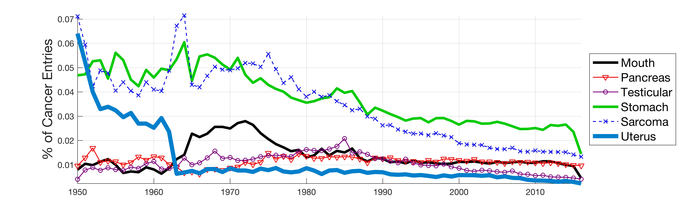
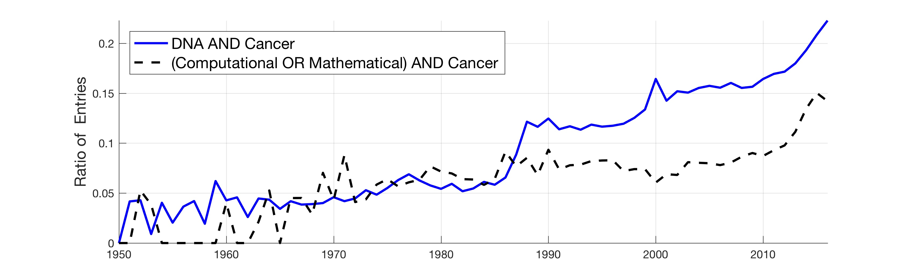

# PubMed-Data-Mining
Repositories used for the data mining of the public database of biomedical literature PubMed . The mining is performed with a series of queries from Matlab.

<h1>Reference  
</h1>

Reyes-Aldasoro CC (2017) The proportion of cancer-related entries in PubMed has increased considerably; is cancer truly “The Emperor of All Maladies”? PLoS ONE 12(3): e0173671. https://doi.org/10.1371/journal.pone.0173671

<h1> Abstract  
</h1>

In this work, the public database of biomedical literature PubMed was mined using queries with combinations of keywords and year restrictions. It was found that the proportion of Cancer-related entries per year in PubMed has risen from around 6% in 1950 to more than 16% in 2016. This increase is not shared by other conditions such as AIDS, Malaria, Tuberculosis, Diabetes, Cardiovascular, Stroke and Infection some of which have, on the contrary, decreased as a proportion of the total entries per year. Organ-related queries were performed to analyse the variation of some specific cancers. A series of queries related to incidence, funding, and relationship with DNA, Computing and Mathematics, were performed to test correlation between the keywords, with the hope of elucidating the cause behind the rise of Cancer in PubMed. Interestingly, the proportion of Cancer-related entries that contain “DNA”, “Computational” or “Mathematical” have increased, which suggests that the impact of these scientific advances on Cancer has been stronger than in other conditions. It is important to highlight that the results obtained with the data mining approach here presented are limited to the presence or absence of the keywords on a single, yet extensive, database. Therefore, results should be observed with caution. All the data used for this work is publicly available through PubMed and the UK’s Office for National Statistics. All queries and figures were generated with the software platform Matlab and the files are available as supplementary material.

 

<h1> Code and Results  
</h1>

The code to automatically mine PubMed and generate these figures is placed in this repository

 

 

 

 

 

 

 

 

 

 

<h1>Extensions</h1>

This code was used to develop an extension "Cancer immunotherapy literature analysis (PubMed papers and registered clinical trials)"  https://github.com/jnkather/immuno_literature. That repository contains the source codes and raw data that were used in the project:

"Large-scale database mining reveals hidden trends and future directions for cancer immunotherapy" https://doi.org/10.1080/2162402X.2018.1444412

This project was published in OncoImmunology. For a detailed description of the computational methods, please refer to the paper. Additional information is also available in the article supplements. The source code was tested in Matlab R2017a.
